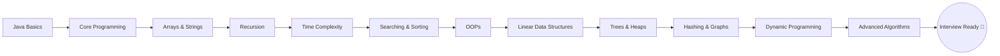

<div align="center">

# 🚀 ZDX-1.0-DSA-with-Java

### *A Complete, Free & Beginner-Friendly Data Structures & Algorithms Course in Java*

<p>
  <em>Learn Concepts Deeply · Build Intuition · Practice Consistently · Become Industry Ready</em>
</p>

[](https://github.com/ZiDDiiX/ZDX-1.0-DSA-with-Java)
[](https://github.com/ZiDDiiX/ZDX-1.0-DSA-with-Java/network/members)
[](https://github.com/ZiDDiiX/ZDX-1.0-DSA-with-Java/issues)
[](#-license)
[](https://www.java.com/)
[](#)

<br>

<a href="https://youtube.com/playlist?list=PLPy-RDoP0_0Z6EywF7SKTTWgRu8uAZKch&si=I_M-I09yUL6C-ORo"></a>
<a href="https://www.notion.so/ZDX-1-0-DSA-with-JAVA-33576d3f18e0804ca776dc35df947725?source=copy_link"></a>
<a href="https://www.youtube.com/@ZiDDiiX"></a>
<a href="https://www.linkedin.com/company/ziddiix/"></a>

</div>

<br>

---

## 📚 Table of Contents

- [About the Repository](#-about-the-repository)
- [About the Course](#-about-the-course)
- [Why This Repository?](#-why-this-repository)
- [Why Learn DSA?](#-why-learn-dsa)
- [Who Is This Course For?](#-who-is-this-course-for)
- [Repository Structure](#-repository-structure)
- [Features](#-features)
- [Course Roadmap](#-course-roadmap)
- [Learning Path](#-learning-path)
- [Learning Resources](#-learning-resources)
- [How to Use This Repository](#-how-to-use-this-repository)
- [Clone Instructions](#-clone-instructions)
- [How to Practice](#-how-to-practice)
- [Tips for Students](#-tips-for-students)
- [Recommended Workflow](#-recommended-workflow)
- [Instructor](#-instructor)
- [Community](#-community)
- [Contribution](#-contribution)
- [Support the Project](#-support-the-project)
- [License](#-license)
- [Connect With Me](#-connect-with-me)

---

## 📖 About the Repository

> **ZDX-1.0-DSA-with-Java** is the official code repository for the complete **Data Structures & Algorithms with Java** course — built lecture by lecture, updated consistently, and designed for students who want to learn programming the right way.

This repository contains **every single line of code taught in class** — organized, lecture-wise, and ready to clone and practice.

<table>
<tr>
<td>

🔄 **Continuously Updated** — New code added after every lecture

🎯 **Beginner Friendly** — Assumes zero prior programming knowledge

💼 **Interview Focused** — Built with placements & real interviews in mind

🧠 **Concept First** — Deep understanding over rote memorization

</td>
</tr>
</table>

---

## 🎓 About the Course

**ZDX 1.0 – DSA with Java** is a **100% FREE**, complete Data Structures & Algorithms course taught from **absolute scratch**.

No assumptions. No skipped steps. Every concept — however small — is explained clearly before moving forward.

<div align="center">

> *"Learn concepts deeply. Build intuition. Practice consistently. Become industry ready."*

</div>

The course isn't just about cracking coding interviews — it's about helping students **genuinely understand programming and problem-solving** so they can think like engineers, not just memorize solutions.

---

## 💡 Why This Repository?

| | |
|---|---|
| 🆓 | Completely free, no paywalls, no hidden content |
| 📦 | All lecture code available in one organized place |
| 🔁 | Updated regularly — never falls behind the course |
| 🧩 | Structured for easy revision before interviews |
| 🌍 | Open to the entire student community |

---

## 🌟 Why Learn DSA?

Data Structures & Algorithms form the **foundation of every technical interview** and are essential for writing efficient, scalable software.

- ✅ Cracks technical interviews at top product & service companies
- ✅ Sharpens logical thinking and problem-solving ability
- ✅ Builds a strong foundation for competitive programming
- ✅ Makes you a better, more confident developer overall

---

## 🙋 Who Is This Course For?

<table>
<tr>
<td width="33%" align="center">

**🐣 Absolute Beginners**
No coding background required

</td>
<td width="33%" align="center">

**🎓 Students**
Preparing for placements & interviews

</td>
<td width="33%" align="center">

**💻 Developers**
Wanting to strengthen DSA fundamentals

</td>
</tr>
</table>

---

## 🗂 Repository Structure

```text
ZDX-1.0-DSA-with-Java/
│
├── Lecture 01 - Introduction & Setup
├── Lecture 02 - Java Basics
├── Lecture 03 - Variables & Data Types
├── Lecture 04 - Operators
├── Lecture 05 - Conditionals
├── Lecture 06 - Loops
├── Lecture 07 - Functions
├── Lecture 08 - Arrays
├── ...
├── Assignments/
│   ├── Assignment 01
│   ├── Assignment 02
│   └── ...
├── Practice Questions/
│   ├── Easy
│   ├── Medium
│   └── Hard
├── Resources/
│   ├── Notes
│   ├── Cheatsheets
│   └── Interview-Questions
└── README.md
```

<details>
<summary>📁 <b>Click to see what's inside each lecture folder</b></summary>
<br>

Each lecture folder typically contains:

- ✅ Java source code written live in class
- ✅ Class notes and explanations
- ✅ Practice questions related to the topic
- ✅ Solutions with clean, commented code

</details>

---

## ✨ Features

<table>
<tr>
<td>📌 <b>Lecture-wise Java Code</b></td>
<td>Every class's code, organized and labeled</td>
</tr>
<tr>
<td>📝 <b>Class Notes</b></td>
<td>Concept explanations to go with the code</td>
</tr>
<tr>
<td>🧪 <b>Practice Questions</b></td>
<td>Hands-on problems for every topic</td>
</tr>
<tr>
<td>📄 <b>Assignments & Solutions</b></td>
<td>Homework with complete solutions</td>
</tr>
<tr>
<td>🎨 <b>Pattern Programs</b></td>
<td>Classic pattern-printing problem sets</td>
</tr>
<tr>
<td>☕ <b>Java Fundamentals</b></td>
<td>Core language concepts explained from zero</td>
</tr>
<tr>
<td>🧱 <b>OOPs Concepts</b></td>
<td>Object-Oriented Programming in depth</td>
</tr>
<tr>
<td>⏱ <b>Time Complexity</b></td>
<td>Big-O analysis for every algorithm covered</td>
</tr>
<tr>
<td>🧮 <b>Data Structures & Algorithms</b></td>
<td>From arrays to graphs and DP</td>
</tr>
<tr>
<td>💼 <b>Interview Questions</b></td>
<td>Curated questions asked in real interviews</td>
</tr>
<tr>
<td>🔮 <b>More Topics Coming</b></td>
<td>Continuously expanding as the course progresses</td>
</tr>
</table>

---

## 🗺 Course Roadmap

> ✅ = Completed &nbsp;&nbsp; 🔄 = In Progress &nbsp;&nbsp; ⏳ = Upcoming

<table>
<tr><th>#</th><th>Topic</th><th>Status</th></tr>
<tr><td>01</td><td>Java Basics</td><td>✅</td></tr>
<tr><td>02</td><td>Variables</td><td>✅</td></tr>
<tr><td>03</td><td>Operators</td><td>✅</td></tr>
<tr><td>04</td><td>Conditionals</td><td>✅</td></tr>
<tr><td>05</td><td>Loops</td><td>✅</td></tr>
<tr><td>06</td><td>Functions</td><td>✅</td></tr>
<tr><td>07</td><td>Arrays</td><td>✅</td></tr>
<tr><td>08</td><td>Strings</td><td>✅</td></tr>
<tr><td>09</td><td>Recursion</td><td>🔄</td></tr>
<tr><td>10</td><td>Time Complexity</td><td>🔄</td></tr>
<tr><td>11</td><td>Searching</td><td>⏳</td></tr>
<tr><td>12</td><td>Sorting</td><td>⏳</td></tr>
<tr><td>13</td><td>OOPs</td><td>⏳</td></tr>
<tr><td>14</td><td>Linked List</td><td>⏳</td></tr>
<tr><td>15</td><td>Stack</td><td>⏳</td></tr>
<tr><td>16</td><td>Queue</td><td>⏳</td></tr>
<tr><td>17</td><td>Trees</td><td>⏳</td></tr>
<tr><td>18</td><td>Binary Search Tree (BST)</td><td>⏳</td></tr>
<tr><td>19</td><td>Heap</td><td>⏳</td></tr>
<tr><td>20</td><td>Hashing</td><td>⏳</td></tr>
<tr><td>21</td><td>Graphs</td><td>⏳</td></tr>
<tr><td>22</td><td>Dynamic Programming</td><td>⏳</td></tr>
<tr><td>23</td><td>Greedy Algorithms</td><td>⏳</td></tr>
<tr><td>24</td><td>Tries</td><td>⏳</td></tr>
<tr><td>25</td><td>Segment Trees</td><td>⏳</td></tr>
<tr><td>26</td><td>Advanced Algorithms</td><td>⏳</td></tr>
</table>

<div align="center">
<sub><i>Roadmap status is updated regularly as new lectures are released.</i></sub>
</div>

---

## 🛤 Learning Path



> 💡 **Tip:** Follow this path in order — every topic builds on the previous one.

---

## 📚 Learning Resources

<table>
<tr>
<td width="50%" valign="top">

### 📺 YouTube Playlist
All lectures, uploaded in sequence, completely free.

🔗 [Watch the Full Playlist](https://youtube.com/playlist?list=PLPy-RDoP0_0Z6EywF7SKTTWgRu8uAZKch&si=I_M-I09yUL6C-ORo)

</td>
<td width="50%" valign="top">

### 📝 Complete Notion Notes
Lecture-wise notes, screenshots, class questions, assignments, and important resources — all in one place.

🔗 [Open Notion Workspace](https://www.notion.so/ZDX-1-0-DSA-with-JAVA-33576d3f18e0804ca776dc35df947725?source=copy_link)

</td>
</tr>
<tr>
<td width="50%" valign="top">

### 🎥 YouTube Channel
New programming content uploaded regularly — beyond just this course.

🔗 [Visit @ZiDDiiX](https://www.youtube.com/@ZiDDiiX)

</td>
<td width="50%" valign="top">

### 💻 This Repository
The single source of truth for all code taught in class, updated after every lecture.

🔗 [Browse the Code](#-repository-structure)

</td>
</tr>
</table>

> ℹ️ **Note:** Use this repository **alongside** the YouTube playlist and Notion notes for the best learning experience.

---

## ⚙️ How to Use This Repository

1. ⭐ Star this repository to keep it easily accessible
2. 📥 Clone or download it to your local machine
3. 🎬 Watch the corresponding lecture on YouTube
4. 📂 Open that lecture's folder and follow along with the code
5. ✍️ Solve the practice questions and assignments yourself
6. 🔁 Revisit the notes on Notion for deeper understanding

---

## 💻 Clone Instructions

```bash
# Clone the repository
git clone https://github.com/ZiDDiiX/ZDX-1.0-DSA-with-Java.git

# Navigate into the project directory
cd ZDX-1.0-DSA-with-Java

# Open in your favorite IDE and start practicing!
```

---

## 🧠 How to Practice?

<table>
<tr><td>1️⃣</td><td>Watch the lecture fully before touching the code</td></tr>
<tr><td>2️⃣</td><td>Try to write the code yourself before checking the repository</td></tr>
<tr><td>3️⃣</td><td>Compare your solution with the provided one</td></tr>
<tr><td>4️⃣</td><td>Solve the practice questions without looking at solutions first</td></tr>
<tr><td>5️⃣</td><td>Revise using the pattern programs and assignments regularly</td></tr>
</table>

---

## 🎯 Tips for Students

> 🗣️ *"Consistency beats intensity. Show up every day, even if it's just for 30 minutes."*

- 🧩 Don't just copy-paste code — understand **why** it works
- 📅 Practice daily, even if only a little
- 🔄 Revisit older topics frequently to retain concepts
- 🤝 Discuss doubts with peers or in the community
- 🏆 Track your progress using the roadmap above

---

## 🔄 Recommended Workflow

```text
Watch Lecture → Read Notion Notes → Write Code Yourself
     → Compare with Repository → Solve Practice Questions
          → Revise Weekly → Track Progress on Roadmap
```

---

## 👩‍🏫 Instructor

<div align="center">

### **Yashika Chaubey**

Founder of **ZiDDiiX**, passionate about making high-quality Computer Science education accessible to everyone.

[](https://www.linkedin.com/in/yashika-chaubey-851952260/)

</div>

---

## 🌐 Community

<div align="center">

### **ZiDDiiX**

A growing **student-first tech community** helping students learn **DSA, Development, AI, and Open Source**, while building strong problem-solving skills.

[](https://www.linkedin.com/company/ziddiix/)
[](https://www.youtube.com/@ZiDDiiX)

</div>

---

## 🤝 Contribution

Contributions, suggestions, and improvements are always welcome!

<details>
<summary><b>📌 How to contribute</b></summary>
<br>

1. 🍴 Fork this repository
2. 🌿 Create a new branch (`git checkout -b feature/your-feature`)
3. 💾 Commit your changes (`git commit -m "Added: your feature"`)
4. 🚀 Push to your branch (`git push origin feature/your-feature`)
5. 📬 Open a Pull Request

</details>

> 💬 Found an issue or have a suggestion? Feel free to open an [issue](https://github.com/ZiDDiiX/ZDX-1.0-DSA-with-Java/issues).

---

## 💖 Support the Project

If this repository has helped you in your learning journey, consider supporting it:

<div align="center">

### ⭐ Show some love by starring this repository! ⭐

**Your star helps this resource reach more students for free.**

[](https://github.com/ZiDDiiX/ZDX-1.0-DSA-with-Java/stargazers)

</div>

---

## 📄 License

This project is licensed under the **MIT License** — free to use for learning and educational purposes.

---

## 📬 Connect With Me

<div align="center">

[](https://www.linkedin.com/in/yashika-chaubey-851952260/)
[](https://www.youtube.com/@ZiDDiiX)
[](https://www.notion.so/ZDX-1-0-DSA-with-JAVA-33576d3f18e0804ca776dc35df947725?source=copy_link)

</div>

---

<div align="center">

### 🌱 Made with ❤️ for students, by **ZiDDiiX**

<sub>© 2026 ZiDDiiX · All Rights Reserved</sub>

</div>
